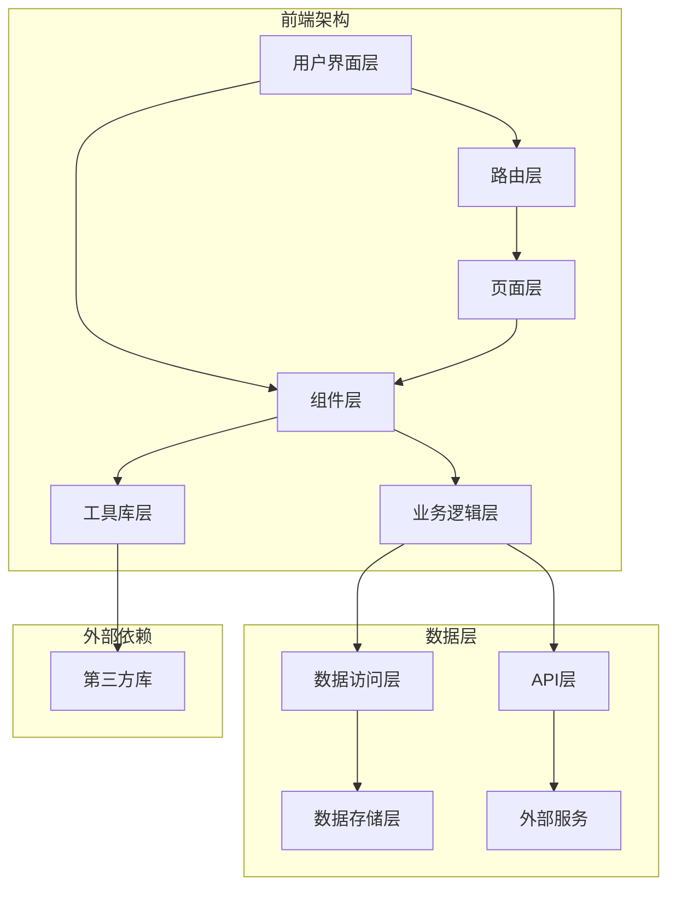
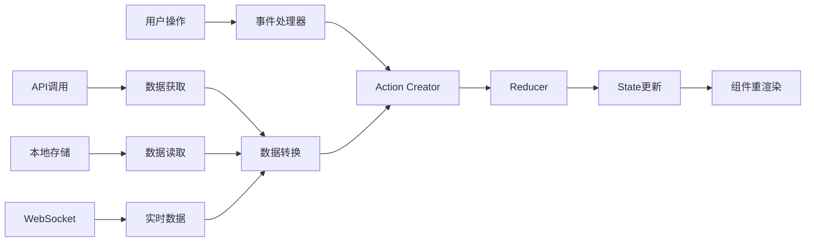

# PDCS-Fronted-UI 架构设计文档

## 📋 目录

1. [系统架构概览](#系统架构概览)
2. [技术栈选择](#技术栈选择)
3. [目录结构设计](#目录结构设计)
4. [模块化设计](#模块化设计)
5. [数据流架构](#数据流架构)
6. [性能优化策略](#性能优化策略)
7. [安全架构](#安全架构)
8. [扩展性设计](#扩展性设计)

---

## 🏗️ 系统架构概览

### 整体架构图



### 核心设计原则

1. **模块化**: 每个功能模块独立开发、测试、部署
2. **可复用性**: 组件和工具函数设计为可复用
3. **类型安全**: 全面使用TypeScript确保类型安全
4. **性能优先**: 代码分割、懒加载、缓存优化
5. **可维护性**: 清晰的代码结构和完善的文档
6. **可扩展性**: 支持插件化扩展和主题定制

---

## 🛠️ 技术栈选择

### 前端框架层

| 技术 | 版本 | 选择理由 | 替代方案 |
|------|------|----------|----------|
| **Next.js** | 14.0.4 | 全栈React框架，SSR/SSG支持，优秀的开发体验 | Vite + React, Remix |
| **React** | 18+ | 成熟的组件化开发，丰富的生态系统 | Vue.js, Svelte |
| **TypeScript** | 5+ | 类型安全，更好的开发体验和代码质量 | JavaScript + JSDoc |

### 样式和UI层

| 技术 | 版本 | 选择理由 | 替代方案 |
|------|------|----------|----------|
| **Tailwind CSS** | 3+ | 原子化CSS，快速开发，高度可定制 | Styled Components, CSS Modules |
| **class-variance-authority** | 0.7.0 | 组件变体管理，类型安全的样式API | clsx + 自定义方案 |
| **Lucide React** | 0.294.0 | 现代化图标库，Tree-shaking友好 | React Icons, Heroicons |

### 数据和状态管理

| 技术 | 版本 | 选择理由 | 替代方案 |
|------|------|----------|----------|
| **React Context** | - | 轻量级状态管理，适合中小型应用 | Redux Toolkit, Zustand |
| **SQLite** | - | 轻量级本地数据库，零配置 | IndexedDB, LocalStorage |
| **React Hook Form** | - | 高性能表单处理 | Formik, 原生表单 |

### 工具和构建

| 技术 | 版本 | 选择理由 | 替代方案 |
|------|------|----------|----------|
| **ESLint** | 8+ | 代码质量检查，团队规范统一 | JSHint, TSLint |
| **Prettier** | 3+ | 代码格式化，保持一致性 | 手动格式化 |
| **Jest** | 29+ | 测试框架，丰富的断言和模拟功能 | Vitest, Mocha |

---

## 📁 目录结构设计

### 项目根目录

```
PDCS-Fronted-UI/
├── 📁 src/                    # 源代码目录
├── 📁 public/                 # 静态资源
├── 📁 docs/                   # 项目文档
├── 📁 tests/                  # 测试文件
├── 📁 scripts/                # 构建脚本
├── 📁 .github/                # GitHub配置
├── 📄 package.json            # 项目配置
├── 📄 tsconfig.json           # TypeScript配置
├── 📄 tailwind.config.js      # Tailwind配置
├── 📄 next.config.js          # Next.js配置
└── 📄 README.md               # 项目说明
```

### src目录详细结构

```
src/
├── 📁 app/                    # Next.js App Router
│   ├── 📁 (routes)/           # 路由组
│   ├── 📁 api/                # API路由
│   ├── 📁 globals.css         # 全局样式
│   ├── 📄 layout.tsx          # 根布局
│   ├── 📄 page.tsx            # 首页
│   └── 📄 not-found.tsx       # 404页面
├── 📁 components/             # 组件库
│   ├── 📁 ui/                 # 基础UI组件
│   ├── 📁 charts/             # 图表组件
│   ├── 📁 forms/              # 表单组件
│   ├── 📁 layout/             # 布局组件
│   └── 📁 business/           # 业务组件
├── 📁 lib/                    # 工具库
│   ├── 📁 utils/              # 通用工具
│   ├── 📁 hooks/              # 自定义Hooks
│   ├── 📁 database/           # 数据库操作
│   ├── 📁 i18n/               # 国际化
│   └── 📁 constants/          # 常量定义
├── 📁 styles/                 # 样式文件
├── 📁 types/                  # 类型定义
└── 📁 assets/                 # 资源文件
```

### 组件目录结构

```
components/
├── 📁 ui/                     # 基础UI组件
│   ├── 📄 button.tsx          # 按钮组件
│   ├── 📄 card.tsx            # 卡片组件
│   ├── 📄 input.tsx           # 输入框组件
│   ├── 📄 badge.tsx           # 徽章组件
│   ├── 📄 progress.tsx        # 进度条组件
│   ├── 📄 tabs.tsx            # 标签页组件
│   ├── 📄 alert.tsx           # 警告组件
│   └── 📄 index.ts            # 统一导出
├── 📁 charts/                 # 图表组件
│   ├── 📄 line-chart.tsx      # 折线图
│   ├── 📄 bar-chart.tsx       # 柱状图
│   ├── 📄 pie-chart.tsx       # 饼图
│   └── 📄 index.ts            # 统一导出
├── 📁 layout/                 # 布局组件
│   ├── 📄 header.tsx          # 页头组件
│   ├── 📄 footer.tsx          # 页脚组件
│   ├── 📄 sidebar.tsx         # 侧边栏组件
│   └── 📄 navigation.tsx      # 导航组件
└── 📁 business/               # 业务组件
    ├── 📄 user-profile.tsx    # 用户资料
    ├── 📄 data-table.tsx      # 数据表格
    └── 📄 dashboard.tsx       # 仪表板
```

---

## 🧩 模块化设计

### 组件设计模式

#### 1. 原子化组件设计

```typescript
// 原子组件 - Button
interface ButtonProps {
  variant: 'primary' | 'secondary' | 'danger'
  size: 'sm' | 'md' | 'lg'
  children: React.ReactNode
  onClick?: () => void
}

export function Button({ variant, size, children, onClick }: ButtonProps) {
  return (
    <button
      className={cn(buttonVariants({ variant, size }))}
      onClick={onClick}
    >
      {children}
    </button>
  )
}
```

#### 2. 分子组件设计

```typescript
// 分子组件 - SearchBox
interface SearchBoxProps {
  placeholder?: string
  onSearch: (query: string) => void
}

export function SearchBox({ placeholder, onSearch }: SearchBoxProps) {
  const [query, setQuery] = useState('')

  return (
    <div className="flex gap-2">
      <Input
        placeholder={placeholder}
        value={query}
        onChange={(e) => setQuery(e.target.value)}
      />
      <Button onClick={() => onSearch(query)}>
        搜索
      </Button>
    </div>
  )
}
```

#### 3. 有机体组件设计

```typescript
// 有机体组件 - UserCard
interface UserCardProps {
  user: User
  onEdit: (user: User) => void
  onDelete: (userId: string) => void
}

export function UserCard({ user, onEdit, onDelete }: UserCardProps) {
  return (
    <Card>
      <CardHeader>
        <CardTitle>{user.name}</CardTitle>
        <CardDescription>{user.email}</CardDescription>
      </CardHeader>
      <CardContent>
        <Badge variant={user.status === 'active' ? 'default' : 'secondary'}>
          {user.status}
        </Badge>
      </CardContent>
      <CardFooter className="gap-2">
        <Button variant="outline" onClick={() => onEdit(user)}>
          编辑
        </Button>
        <Button variant="destructive" onClick={() => onDelete(user.id)}>
          删除
        </Button>
      </CardFooter>
    </Card>
  )
}
```

### 功能模块设计

#### 1. 国际化模块

```typescript
// lib/i18n/index.ts
export interface I18nConfig {
  defaultLanguage: string
  supportedLanguages: string[]
  fallbackLanguage: string
}

export class I18nManager {
  private config: I18nConfig
  private translations: Map<string, Record<string, any>>

  constructor(config: I18nConfig) {
    this.config = config
    this.translations = new Map()
  }

  async loadTranslations(language: string): Promise<void> {
    // 加载翻译文件
  }

  translate(key: string, params?: Record<string, any>): string {
    // 翻译逻辑
  }
}
```

#### 2. 主题模块

```typescript
// lib/theme/index.ts
export interface ThemeConfig {
  colors: Record<string, string>
  fonts: Record<string, string>
  spacing: Record<string, string>
  breakpoints: Record<string, string>
}

export class ThemeManager {
  private themes: Map<string, ThemeConfig>
  private currentTheme: string

  constructor() {
    this.themes = new Map()
    this.currentTheme = 'default'
  }

  registerTheme(name: string, config: ThemeConfig): void {
    this.themes.set(name, config)
  }

  switchTheme(name: string): void {
    if (this.themes.has(name)) {
      this.currentTheme = name
      this.applyTheme(this.themes.get(name)!)
    }
  }

  private applyTheme(config: ThemeConfig): void {
    // 应用主题样式
  }
}
```

#### 3. 数据库模块

```typescript
// lib/database/index.ts
export interface DatabaseConfig {
  name: string
  version: number
  stores: Record<string, any>
}

export abstract class DatabaseAdapter {
  abstract connect(): Promise<void>
  abstract disconnect(): Promise<void>
  abstract query(sql: string, params?: any[]): Promise<any[]>
  abstract execute(sql: string, params?: any[]): Promise<any>
}

export class SQLiteAdapter extends DatabaseAdapter {
  private db: any

  async connect(): Promise<void> {
    // SQLite连接逻辑
  }

  async query(sql: string, params?: any[]): Promise<any[]> {
    // 查询实现
  }
}

export class DatabaseManager {
  private adapter: DatabaseAdapter

  constructor(adapter: DatabaseAdapter) {
    this.adapter = adapter
  }

  async initialize(): Promise<void> {
    await this.adapter.connect()
  }

  async createTable(name: string, schema: Record<string, string>): Promise<void> {
    const sql = this.generateCreateTableSQL(name, schema)
    await this.adapter.execute(sql)
  }
}
```

---

## 🔄 数据流架构

### 状态管理架构

```typescript
// 全局状态管理
interface AppState {
  user: User | null
  theme: Theme
  language: string
  ui: {
    loading: boolean
    error: string | null
    notifications: Notification[]
  }
}

type AppAction =
  | { type: 'SET_USER'; payload: User }
  | { type: 'SET_THEME'; payload: Theme }
  | { type: 'SET_LANGUAGE'; payload: string }
  | { type: 'SET_LOADING'; payload: boolean }
  | { type: 'SET_ERROR'; payload: string | null }
  | { type: 'ADD_NOTIFICATION'; payload: Notification }

// Context Provider
export function AppProvider({ children }: { children: React.ReactNode }) {
  const [state, dispatch] = useReducer(appReducer, initialState)

  return (
    <AppContext.Provider value={{ state, dispatch }}>
      {children}
    </AppContext.Provider>
  )
}
```

### 数据流向图



### 异步数据处理

```typescript
// 自定义Hook处理异步数据
export function useAsyncData<T>(
  fetcher: () => Promise<T>,
  deps: any[] = []
) {
  const [data, setData] = useState<T | null>(null)
  const [loading, setLoading] = useState(true)
  const [error, setError] = useState<Error | null>(null)

  useEffect(() => {
    let cancelled = false

    const fetchData = async () => {
      try {
        setLoading(true)
        setError(null)
        const result = await fetcher()
        if (!cancelled) {
          setData(result)
        }
      } catch (err) {
        if (!cancelled) {
          setError(err as Error)
        }
      } finally {
        if (!cancelled) {
          setLoading(false)
        }
      }
    }

    fetchData()

    return () => {
      cancelled = true
    }
  }, deps)

  return { data, loading, error, refetch: () => fetchData() }
}
```

---

## ⚡ 性能优化策略

### 1. 代码分割和懒加载

```typescript
// 路由级别的代码分割
import { lazy, Suspense } from 'react'

const Dashboard = lazy(() => import('@/app/dashboard/page'))
const Profile = lazy(() => import('@/app/profile/page'))

export function AppRouter() {
  return (
    <Suspense fallback={<div>加载中...</div>}>
      <Routes>
        <Route path="/dashboard" element={<Dashboard />} />
        <Route path="/profile" element={<Profile />} />
      </Routes>
    </Suspense>
  )
}

// 组件级别的懒加载
const HeavyChart = lazy(() => import('@/components/charts/heavy-chart'))

function Dashboard() {
  const [showChart, setShowChart] = useState(false)

  return (
    <div>
      <button onClick={() => setShowChart(true)}>显示图表</button>
      {showChart && (
        <Suspense fallback={<div>图表加载中...</div>}>
          <HeavyChart />
        </Suspense>
      )}
    </div>
  )
}
```

### 2. 组件优化

```typescript
// 使用React.memo优化组件渲染
export const OptimizedUserCard = React.memo(function UserCard({
  user,
  onEdit,
  onDelete
}: UserCardProps) {
  return (
    <Card>
      <CardHeader>
        <CardTitle>{user.name}</CardTitle>
      </CardHeader>
      <CardFooter>
        <Button onClick={() => onEdit(user)}>编辑</Button>
        <Button onClick={() => onDelete(user.id)}>删除</Button>
      </CardFooter>
    </Card>
  )
}, (prevProps, nextProps) => {
  // 自定义比较函数
  return prevProps.user.id === nextProps.user.id &&
         prevProps.user.name === nextProps.user.name
})

// 使用useMemo优化计算
function ExpensiveList({ items }: { items: Item[] }) {
  const sortedItems = useMemo(() => {
    return items.sort((a, b) => a.priority - b.priority)
  }, [items])

  const totalValue = useMemo(() => {
    return items.reduce((sum, item) => sum + item.value, 0)
  }, [items])

  return (
    <div>
      <p>总价值: {totalValue}</p>
      {sortedItems.map(item => (
        <ItemCard key={item.id} item={item} />
      ))}
    </div>
  )
}
```

### 3. 数据缓存策略

```typescript
// 内存缓存
class MemoryCache {
  private cache = new Map<string, { data: any; timestamp: number; ttl: number }>()

  set(key: string, data: any, ttl: number = 5 * 60 * 1000): void {
    this.cache.set(key, {
      data,
      timestamp: Date.now(),
      ttl
    })
  }

  get(key: string): any | null {
    const item = this.cache.get(key)
    if (!item) return null

    if (Date.now() - item.timestamp > item.ttl) {
      this.cache.delete(key)
      return null
    }

    return item.data
  }

  clear(): void {
    this.cache.clear()
  }
}

// 使用缓存的数据获取Hook
export function useCachedData<T>(
  key: string,
  fetcher: () => Promise<T>,
  ttl: number = 5 * 60 * 1000
) {
  const cache = useMemo(() => new MemoryCache(), [])
  const [data, setData] = useState<T | null>(null)
  const [loading, setLoading] = useState(false)

  const fetchData = useCallback(async () => {
    // 先检查缓存
    const cached = cache.get(key)
    if (cached) {
      setData(cached)
      return
    }

    // 缓存未命中，获取新数据
    setLoading(true)
    try {
      const result = await fetcher()
      cache.set(key, result, ttl)
      setData(result)
    } finally {
      setLoading(false)
    }
  }, [key, fetcher, ttl, cache])

  useEffect(() => {
    fetchData()
  }, [fetchData])

  return { data, loading, refetch: fetchData }
}
```

### 4. 虚拟滚动

```typescript
// 虚拟列表组件
interface VirtualListProps<T> {
  items: T[]
  itemHeight: number
  containerHeight: number
  renderItem: (item: T, index: number) => React.ReactNode
}

export function VirtualList<T>({
  items,
  itemHeight,
  containerHeight,
  renderItem
}: VirtualListProps<T>) {
  const [scrollTop, setScrollTop] = useState(0)

  const visibleStart = Math.floor(scrollTop / itemHeight)
  const visibleEnd = Math.min(
    visibleStart + Math.ceil(containerHeight / itemHeight) + 1,
    items.length
  )

  const visibleItems = items.slice(visibleStart, visibleEnd)

  return (
    <div
      style={{ height: containerHeight, overflow: 'auto' }}
      onScroll={(e) => setScrollTop(e.currentTarget.scrollTop)}
    >
      <div style={{ height: items.length * itemHeight, position: 'relative' }}>
        {visibleItems.map((item, index) => (
          <div
            key={visibleStart + index}
            style={{
              position: 'absolute',
              top: (visibleStart + index) * itemHeight,
              height: itemHeight,
              width: '100%'
            }}
          >
            {renderItem(item, visibleStart + index)}
          </div>
        ))}
      </div>
    </div>
  )
}
```

---

## 🔒 安全架构

### 1. 输入验证和清理

```typescript
// 输入验证工具
export class InputValidator {
  static sanitizeString(input: string): string {
    return input
      .replace(/[<>]/g, '') // 移除HTML标签
      .replace(/javascript:/gi, '') // 移除JavaScript协议
      .trim()
  }

  static validateEmail(email: string): boolean {
    const emailRegex = /^[^\s@]+@[^\s@]+\.[^\s@]+$/
    return emailRegex.test(email)
  }

  static validatePassword(password: string): {
    isValid: boolean
    errors: string[]
  } {
    const errors: string[] = []

    if (password.length < 8) {
      errors.push('密码长度至少8位')
    }
    if (!/[A-Z]/.test(password)) {
      errors.push('密码必须包含大写字母')
    }
    if (!/[a-z]/.test(password)) {
      errors.push('密码必须包含小写字母')
    }
    if (!/\d/.test(password)) {
      errors.push('密码必须包含数字')
    }

    return {
      isValid: errors.length === 0,
      errors
    }
  }
}

// 表单验证Hook
export function useFormValidation<T>(
  initialValues: T,
  validationRules: Record<keyof T, (value: any) => string | null>
) {
  const [values, setValues] = useState(initialValues)
  const [errors, setErrors] = useState<Partial<Record<keyof T, string>>>({})

  const validate = useCallback((field?: keyof T) => {
    const newErrors: Partial<Record<keyof T, string>> = {}

    const fieldsToValidate = field ? [field] : Object.keys(validationRules) as (keyof T)[]

    fieldsToValidate.forEach(key => {
      const error = validationRules[key](values[key])
      if (error) {
        newErrors[key] = error
      }
    })

    setErrors(prev => ({ ...prev, ...newErrors }))
    return Object.keys(newErrors).length === 0
  }, [values, validationRules])

  const setValue = useCallback((field: keyof T, value: any) => {
    setValues(prev => ({ ...prev, [field]: value }))
    // 清除该字段的错误
    setErrors(prev => ({ ...prev, [field]: undefined }))
  }, [])

  return {
    values,
    errors,
    setValue,
    validate,
    isValid: Object.keys(errors).length === 0
  }
}
```

### 2. XSS防护

```typescript
// XSS防护工具
export class XSSProtection {
  private static readonly DANGEROUS_PATTERNS = [
    /<script\b[^<]*(?:(?!<\/script>)<[^<]*)*<\/script>/gi,
    /javascript:/gi,
    /on\w+\s*=/gi,
    /<iframe\b[^<]*(?:(?!<\/iframe>)<[^<]*)*<\/iframe>/gi
  ]

  static sanitizeHTML(html: string): string {
    let sanitized = html

    this.DANGEROUS_PATTERNS.forEach(pattern => {
      sanitized = sanitized.replace(pattern, '')
    })

    return sanitized
  }

  static escapeHTML(text: string): string {
    const div = document.createElement('div')
    div.textContent = text
    return div.innerHTML
  }
}

// 安全的HTML渲染组件
interface SafeHTMLProps {
  html: string
  className?: string
}

export function SafeHTML({ html, className }: SafeHTMLProps) {
  const sanitizedHTML = useMemo(() => {
    return XSSProtection.sanitizeHTML(html)
  }, [html])

  return (
    <div
      className={className}
      dangerouslySetInnerHTML={{ __html: sanitizedHTML }}
    />
  )
}
```

### 3. CSRF防护

```typescript
// CSRF令牌管理
export class CSRFProtection {
  private static token: string | null = null

  static async getToken(): Promise<string> {
    if (!this.token) {
      const response = await fetch('/api/csrf-token')
      const data = await response.json()
      this.token = data.token
    }
    return this.token
  }

  static async makeSecureRequest(
    url: string,
    options: RequestInit = {}
  ): Promise<Response> {
    const token = await this.getToken()

    return fetch(url, {
      ...options,
      headers: {
        ...options.headers,
        'X-CSRF-Token': token,
        'Content-Type': 'application/json'
      }
    })
  }
}

// 安全的API调用Hook
export function useSecureAPI() {
  const makeRequest = useCallback(async (
    url: string,
    options: RequestInit = {}
  ) => {
    try {
      const response = await CSRFProtection.makeSecureRequest(url, options)

      if (!response.ok) {
        throw new Error(`HTTP ${response.status}: ${response.statusText}`)
      }

      return await response.json()
    } catch (error) {
      console.error('API请求失败:', error)
      throw error
    }
  }, [])

  return { makeRequest }
}
```

---

## 🚀 扩展性设计

### 1. 插件系统架构

```typescript
// 插件接口定义
export interface Plugin {
  name: string
  version: string
  dependencies?: string[]

  install(app: Application): void | Promise<void>
  uninstall?(app: Application): void | Promise<void>

  hooks?: {
    beforeMount?: () => void
    afterMount?: () => void
    beforeUnmount?: () => void
  }
}

// 插件管理器
export class PluginManager {
  private plugins = new Map<string, Plugin>()
  private installedPlugins = new Set<string>()

  register(plugin: Plugin): void {
    this.plugins.set(plugin.name, plugin)
  }

  async install(pluginName: string, app: Application): Promise<void> {
    const plugin = this.plugins.get(pluginName)
    if (!plugin) {
      throw new Error(`插件 ${pluginName} 未找到`)
    }

    // 检查依赖
    if (plugin.dependencies) {
      for (const dep of plugin.dependencies) {
        if (!this.installedPlugins.has(dep)) {
          throw new Error(`缺少依赖插件: ${dep}`)
        }
      }
    }

    // 执行安装前钩子
    plugin.hooks?.beforeMount?.()

    // 安装插件
    await plugin.install(app)

    this.installedPlugins.add(pluginName)

    // 执行安装后钩子
    plugin.hooks?.afterMount?.()
  }

  async uninstall(pluginName: string, app: Application): Promise<void> {
    const plugin = this.plugins.get(pluginName)
    if (!plugin || !this.installedPlugins.has(pluginName)) {
      return
    }

    plugin.hooks?.beforeUnmount?.()

    if (plugin.uninstall) {
      await plugin.uninstall(app)
    }

    this.installedPlugins.delete(pluginName)
  }
}
```

### 2. 主题扩展系统

```typescript
// 主题接口
export interface ThemeExtension {
  name: string
  colors: Record<string, string>
  fonts?: Record<string, string>
  components?: Record<string, any>
  customCSS?: string
}

// 主题注册器
export class ThemeRegistry {
  private themes = new Map<string, ThemeExtension>()

  register(theme: ThemeExtension): void {
    this.themes.set(theme.name, theme)
  }

  get(name: string): ThemeExtension | undefined {
    return this.themes.get(name)
  }

  list(): string[] {
    return Array.from(this.themes.keys())
  }

  apply(name: string): void {
    const theme = this.themes.get(name)
    if (!theme) return

    // 应用颜色变量
    const root = document.documentElement
    Object.entries(theme.colors).forEach(([key, value]) => {
      root.style.setProperty(`--color-${key}`, value)
    })

    // 应用字体
    if (theme.fonts) {
      Object.entries(theme.fonts).forEach(([key, value]) => {
        root.style.setProperty(`--font-${key}`, value)
      })
    }

    // 应用自定义CSS
    if (theme.customCSS) {
      const styleId = `theme-${name}`
      let styleElement = document.getElementById(styleId)

      if (!styleElement) {
        styleElement = document.createElement('style')
        styleElement.id = styleId
        document.head.appendChild(styleElement)
      }

      styleElement.textContent = theme.customCSS
    }
  }
}
```

### 3. 组件扩展机制

```typescript
// 组件扩展接口
export interface ComponentExtension<T = any> {
  name: string
  component: React.ComponentType<T>
  props?: Partial<T>
  wrapper?: React.ComponentType<{ children: React.ReactNode }>
}

// 组件注册器
export class ComponentRegistry {
  private components = new Map<string, ComponentExtension>()
  private overrides = new Map<string, ComponentExtension>()

  register(extension: ComponentExtension): void {
    this.components.set(extension.name, extension)
  }

  override(name: string, extension: ComponentExtension): void {
    this.overrides.set(name, extension)
  }

  get(name: string): ComponentExtension | undefined {
    return this.overrides.get(name) || this.components.get(name)
  }

  create(name: string, props: any = {}): React.ReactElement | null {
    const extension = this.get(name)
    if (!extension) return null

    const Component = extension.component
    const mergedProps = { ...extension.props, ...props }

    const element = React.createElement(Component, mergedProps)

    if (extension.wrapper) {
      const Wrapper = extension.wrapper
      return React.createElement(Wrapper, {}, element)
    }

    return element
  }
}

// 动态组件渲染器
interface DynamicComponentProps {
  name: string
  props?: any
  fallback?: React.ReactNode
}

export function DynamicComponent({
  name,
  props,
  fallback
}: DynamicComponentProps) {
  const registry = useContext(ComponentRegistryContext)

  const component = useMemo(() => {
    return registry?.create(name, props)
  }, [registry, name, props])

  if (!component) {
    return fallback || <div>组件 {name} 未找到</div>
  }

  return component
}
```

---

## 📊 监控和调试

### 1. 性能监控

```typescript
// 性能监控工具
export class PerformanceMonitor {
  private metrics = new Map<string, number[]>()

  mark(name: string): void {
    performance.mark(name)
  }

  measure(name: string, startMark: string, endMark?: string): number {
    const measureName = `${name}-measure`
    performance.measure(measureName, startMark, endMark)

    const entries = performance.getEntriesByName(measureName)
    const duration = entries[entries.length - 1]?.duration || 0

    // 记录指标
    if (!this.metrics.has(name)) {
      this.metrics.set(name, [])
    }
    this.metrics.get(name)!.push(duration)

    return duration
  }

  getMetrics(name: string): {
    average: number
    min: number
    max: number
    count: number
  } {
    const values = this.metrics.get(name) || []

    return {
      average: values.reduce((sum, val) => sum + val, 0) / values.length,
      min: Math.min(...values),
      max: Math.max(...values),
      count: values.length
    }
  }

  clear(): void {
    this.metrics.clear()
    performance.clearMarks()
    performance.clearMeasures()
  }
}

// 性能监控Hook
export function usePerformanceMonitor() {
  const monitor = useMemo(() => new PerformanceMonitor(), [])

  const measureRender = useCallback((componentName: string) => {
    const startMark = `${componentName}-render-start`
    const endMark = `${componentName}-render-end`

    monitor.mark(startMark)

    return () => {
      monitor.mark(endMark)
      const duration = monitor.measure(`${componentName}-render`, startMark, endMark)
      console.log(`${componentName} 渲染耗时: ${duration.toFixed(2)}ms`)
    }
  }, [monitor])

  return { monitor, measureRender }
}
```

---

## 📚 总结

PDCS-Fronted-UI的架构设计遵循以下核心原则：

1. **模块化**: 清晰的模块边界，便于维护和扩展
2. **类型安全**: 全面的TypeScript支持
3. **性能优先**: 多层次的性能优化策略
4. **安全可靠**: 完善的安全防护机制
5. **可扩展**: 插件化的扩展系统
6. **可监控**: 完整的监控和调试工具

这个架构为企业级前端应用提供了坚实的基础，支持快速开发、安全部署和持续迭代。

---

**PDCS-Fronted-UI Architecture** - 企业级前端架构设计 🏗️